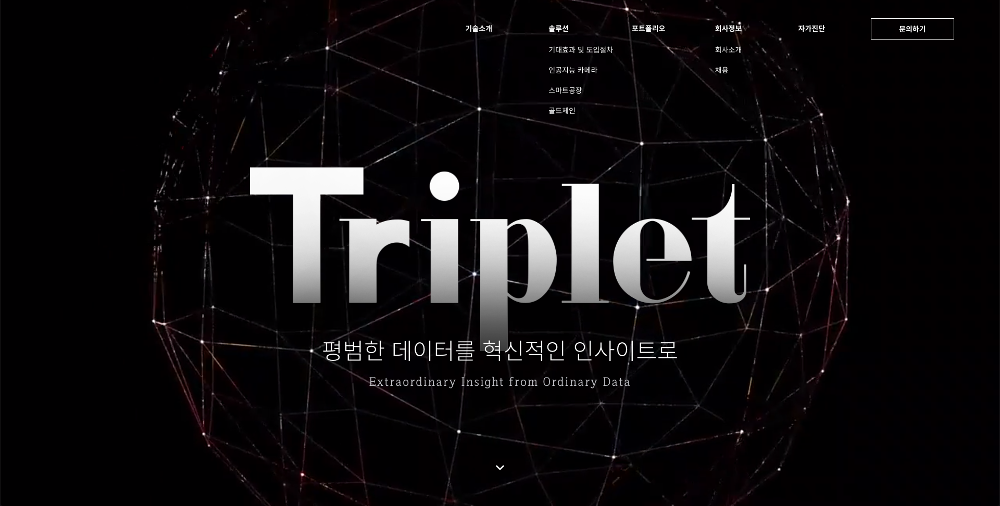
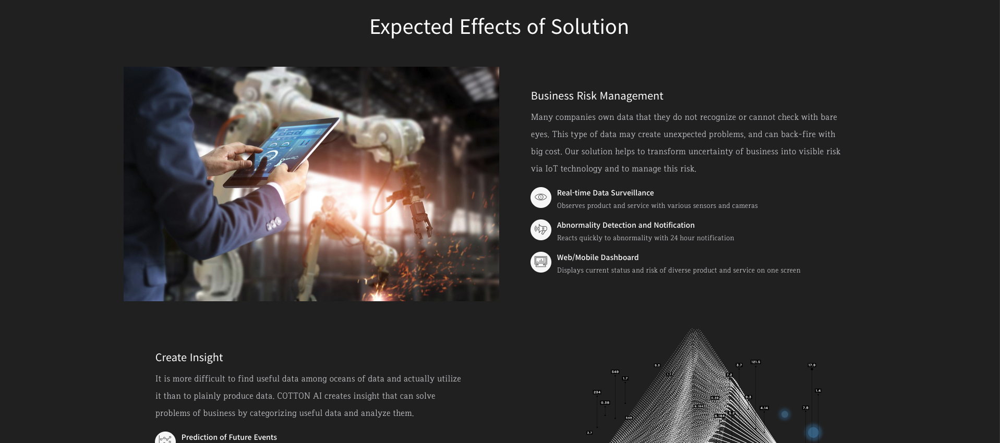
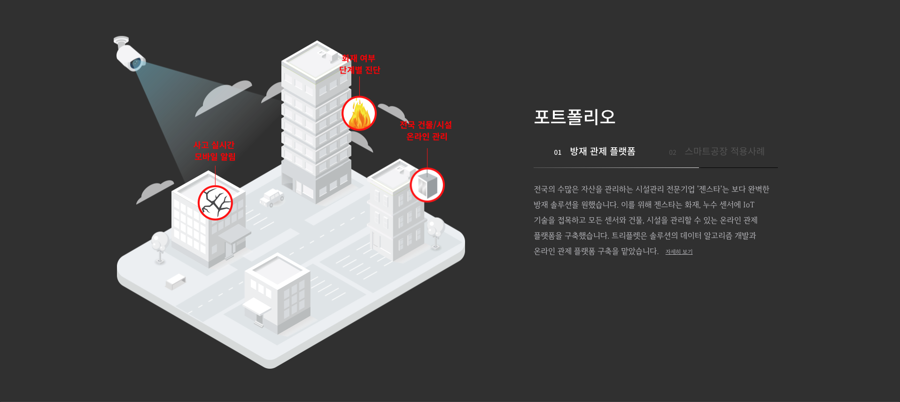
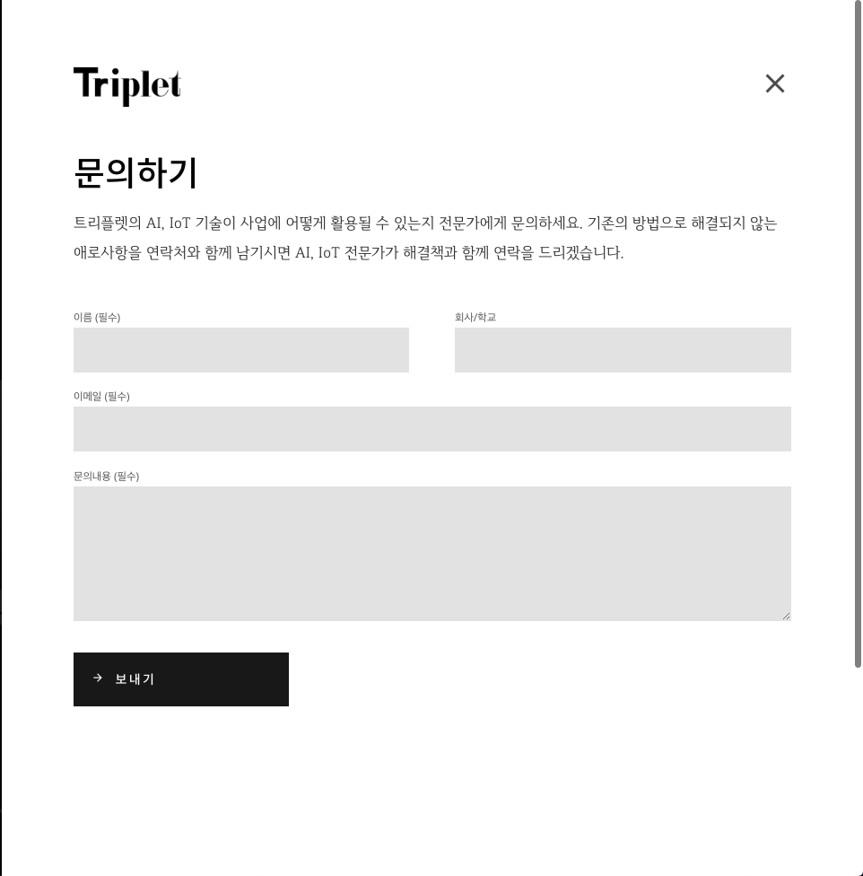
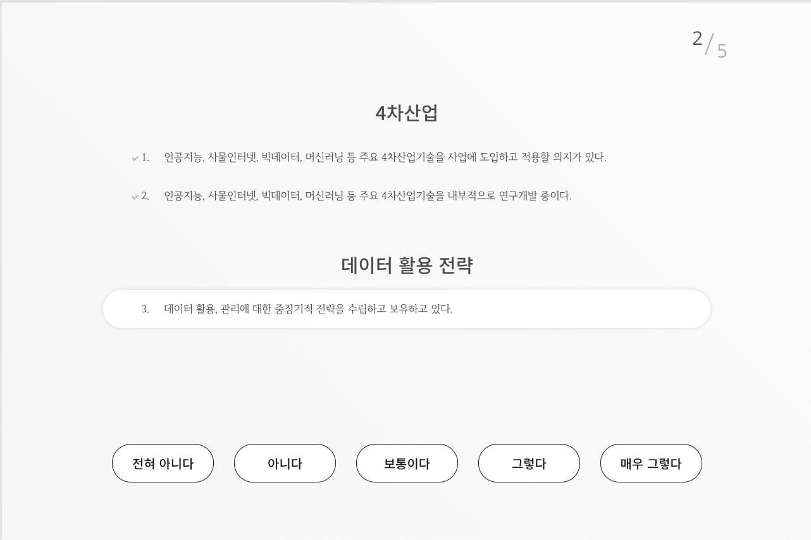
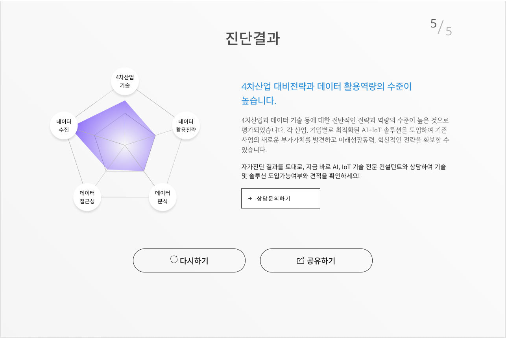

## 자사 홈페이지 개발

### 프로젝트 소개 

- 자사 홈페이지 개발 리뉴얼

### 이미지

### URL
- [Triplet](triplllet.com)

### 개발 기간
- 2018-04 ~ 2018-05

### 개발 인원
- 2명

### 담당 업무
- 사이트 개발 및 유지보수

### 사용 기술

- Cross Browsing, 반응형 웹
 

- codeIgniter, 다국어 설정(한국어, 영어)
 

- jQuery, jQuery UI, scroll-magic, Velocity.js, GreenSock Js, Bootstrap, D3.js
 

- HTML5, CSS3, CSS Animation, Youtube, Video Tag, SVG, Canvas
 

- SourceTree, Invision